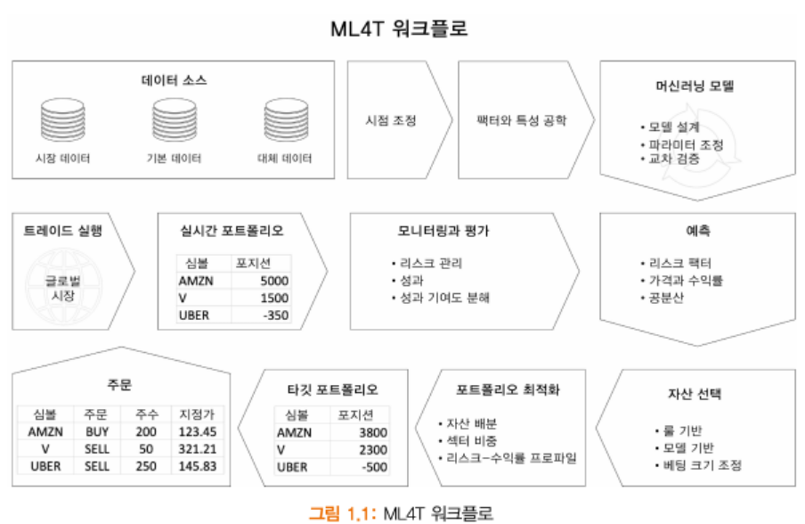
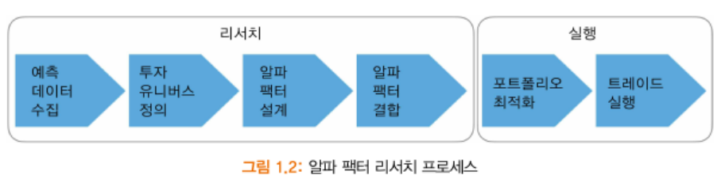

# 1부 데이터, 알파 팩터, 포트폴리오
## 1장. 트레이딩용 머신러닝: 아이디어에서 주문 집행까지
- 알고리듬 트레이딩: 트레이딩 전략의 일부 요소나 모든 요소를 자동화하고자 알고리듬을 실행하는 컴퓨터 프로그램
    - 알고리듬: 목표를 달성하고자 설계된 일련의 절차나 규칙

- 머신러닝: 예측 오차 최소화 같은 목표를 달성하고자 데이터에서 규칙이나 패턴을 학습하는 알고리듬 포함
    - *도서는 머신러닝 알고리듬으로 데이터에서 정보를 추출하고 핵심 투자 활동을 지원하거나 자동화하는 방법을 다룸*

- **액티브 투자 운용의 목표: 평가에 사용된 벤치마크를 초과하는 포트폴리오 수익으로 정의되는 알파를 생성하는 것**
    - 적극적 관리의 기본 법칙: 알파 생성의 핵심이 이러한 예측에 따라 행동할 수 있는 능력과 결합해서 정확한 수익 예측을 갖는다는 것을 가정
    - 정보 비율(IR, Information Ratio): 적극적 관리의 기본 법칙을 정보 비율로 정의하고 있으며, 이는 적극적인 투자 운용의 가치를 포트폴리오와 해당 수익률의 변동성에 벤치마크 간 수익률 차이의 비율로 표현. 다음의 곱으로 IR을 근사화:
        - 결과와의 순위 상관관계로 예측의 질을 측정하는 정보 계수(IC, Information Coeffiecient)
        - 이러한 예측에 대한 독립 베팅 수로 표현되는 전략 폭(breadth of strategy)의 제곱근

### 1-1. 투자업계에서 머신러닝의 부상
- 현재 알고리듬 트레이딩과 머신러닝을 두드러지게 추진하게 된 트렌드
    - 전자 거래의 확산, 자산군과 지역에 걸친 시장 통합과 같은 시장 미시 구조의 변화
    - 자산군과 반대되는 리스트 팩터 노출 측면에서 투자 전략의 개발
    - 컴퓨팅 파워, 데이터 생성, 관리, 통께적 방법의 혁명(딥러닝 돌파구 포함)
    - 인간의 임의 일임 거래와 비교해 알고리듬 트레이딩에서 선구자들의 성과

- 2001년, 2008년 금융 위기 이후, 상장 지수 펀드(ETF, Exchange Traded Funds) 형태의 저비용 패시브 투자 수단 증가

#### 1-1-1. 전자 거래에서 고빈도 매매(HFT)까지
- 전자 증권 거래 네트워크(ECN, Electronic Communication Networks)
    - 미국증권거래위원회(SEC)의 주문 처리 규칙은 ECN을 통한 거래소 경쟁 체제 도입
    - ECN은 주로 주식 및 통화에 대해 브로커-딜러로 등록되어 지정된 가격으로 매수 및 매도 주문을 매칭시키는 자동화된 대체 거래 시스템(ATS, Alternative Trading Systems)
    - 다크풀(Dark Pool)
        - ECN과 경쟁하기 전 거래소가 주문장(order book)을 관리하는 방식과 달리 기관 투자자가 공개하지 않고 대량을 주문을 거래
        - 대량 주문의 불리한 가격 변동 우려와 고빈도 매매(HFT Trader)에 의한 주문 선행 매매에 대한 우려로 2000년대 중반 이후 성장
        - 대형 은행 내에 수용되며, SEC 규정의 적용을 받음

- 고빈도 매매(High-Frequency Trading, HFT)
    - 초당 수십 개 이상의 거래를 처리할 수 있는 컴퓨터 알고리즘을 사용하여 매우 짧은 시간 동안 거래를 수행하는 전략
    - 고빈도 거래에서는 속도와 반응성이 매우 중요하기 때문에 ML 기술이 거래 알고리즘의 개발과 실행에 활용

#### 1-1-2. 팩터 투자와 스마트 베타 펀드
- 팩터 투자
    - 특정 시장 요인(팩터)에 기반한 포트폴리오를 구성하는 전략
    -  팩터는 주식 시장에서 일관된 수익을 창출할 수 있다고 간주됨
        - 대표적인 팩터: 가격-수익비율(P/E), 시가총액, 이익성, 성장성 등
    - ML로 다양한 데이터와 알고리즘을 활용하여 이러한 팩터를 식별하고 포트폴리오를 구성
- 스마트 베타 펀드
    - 특정 시장 팩터에 노출될 수 있는 포트폴리오를 구성하는 인덱스 펀드
    - 전통적인 베타 펀드와는 달리 ML 및 통계적 기법을 활용하여 포트폴리오를 구성하고 운용
    - 투자자에게 다양한 시장 팩터에 노출될 수 있는 투자 기회를 제공하며, ML은 이러한 펀드의 구성과 운용에 큰 영향을 미침

#### 1-1-3. 알고리듬 개척자는 인간보다 우위에 있다
- 알고리즘 트레이딩: 컴퓨터 알고리즘을 사용하여 투자 결정을 자동화하는 전략
    - 속도, 정확성, 감정적 요소의 제거 등을 통해 투자 성과를 향상

1. 머신러닝 기반 펀드 1조 달러 운용 자산 유치
    - 기계 학습 기술은 투자자들에게 더 나은 성과를 제공하는 ML 기반 펀드의 부상을 이끔
        - AQR Capital Management은 기계 학습을 활용하여 투자 전략을 개발하고 운용하는 퀀트멘탈 펀드를 운영
        - 2016년 출시 이후 단기간에 1조 달러 이상의 자산을 모으며, 투자자들에게 매우 높은 수익률을 제공

2. 퀀트멘탈 펀드의 출현
    - 퀀트멘탈 펀드: 기존의 펀드와 달리 기계 학습 및 통계 모델을 활용하여 포트폴리오를 구성하고 운용하는 전략을 채택한 펀드
        - 기업의 재무 데이터, 경제 지표, 신문 기사 등 다양한 데이터를 수집하여 기계 학습 및 통계 모델을 적용하여 포트폴리오를 구성
        - 기계 학습의 발전과 데이터의 가용성으로 인해 성장하고 있으며, 알고리즘 트레이딩의 한 형태

#### 1-1-4. 머신러닝과 대체 데이터
- 헤지펀드는 오랫동안 정보 우위와 상관관계가 없는 새로운 신호를 발견하는 능력을 통해 알파를 추구함
- ML을 사용하여 기존 및 대체 데이터 소스를 활용함으로써 얻을 수 있는 정보적 이점은 전문가 및 업계 네트워크나 기업 경영진에 대한 접근성이 아니라 대량의 데이터를 수집하고 실시간으로 분석할 수 있는 능력과 관련

- 알고리즘 트레이딩 전략에서 데이터 사용에 혁신을 가져온 세 가지 트렌드는 투자업계를 재량 투자에서 퀀트 스타일로 전환시킬 수 있습니다:
    1. 디지털 데이터 양의 기하급수적 증가
    2. 낮은 비용으로 컴퓨팅 파워와 데이터 저장 용량의 증가
    3. 복잡한 데이터 세트를 분석하기 위한 ML 방법의 발전

### 1-2. 머신러닝 기반 전략의 설계와 실행
- ML은 트레이딩 전략의 라이프사이클에서 여러 단계에서 가치를 더할 수 있으며, 주요 인프라와 데이터 리소스에 의존
    - *이 책은 ML 기법이 전략 설계, 실행, 평가의 광범위한 프로세스에 어떻게 적용되는지 설명*

- 알고리즘 트레이딩 전략은 하나 또는 여러 데이터 소스를 신호로 변환하여 미래 자산 수익을 예측하고 매수 또는 매도 주문을 트리거하는 알파 요소의 조합에 의해 구동됨

- ML4T 워크플로

    - 1부: 다양한 전략과 머신러닝 사용 사례에 적용되는 중요한 기술과 기법 소개
        1. 중요한 데이터 소스를 소싱하고 관리하는 방법
        2. 신호 내용을 추출하는 정보 특성이나 알파 팩터를 엔지니어링하는 방법
        3. 포트폴리오를 관리하고 전략 성과를 추적하는 방법
    - 2부: 8장에서 전략 백테스팅을 다룸
    - 2~4부: 머신러닝 사용 사례로 전환하기 전 각 영역 설명

#### 1-2-1. 데이터의 소싱과 관리
- 데이터의 공급은 다음 스텝을 포함해 잠재적인 가치를 발견하기 위한 신중한 선택과 관리 필요:
    1. 알파 신호를 포함해 시장, 펀드멘탈, 대체 데이터 소스를 식별하고 평가
    2. 클라우드 기반의 확장 가능한 데이터 인프라와 하둡 또는 스파크와 같은 분석 도구를 배포하거나 액세스해 빠르고 유연한 데이터 액세스를 용이하게 함
    3. PIT 기준으로 원하는 빈도로 조정해 선견자 편향을 피하고자 데이터를 관리하고 선별.
        - 데이터는 주어진 기간에 사용할 수 있고, 알려진 정보만 반영해야 함

#### 1-2-2. 알파 팩터 리서치에서 포트폴리오 관리까지
- 알파 팩터는 데이터에서 신호를 추출해 거래 기간 동안 주어진 투자 영역에 대한 수익을 예측하도록 설계됨
- 일반적인 팩터는 주어진 시점에서 평가될 때 각 자산에 대해 단일 값을 취하지만 하나 또는 여러 입력 변수, 기간을 결합할 수 있음

- 알파 팩터 리서치 프로세스

### 1-2-3. 전략 백테스팅
- 투자 아이디어를 알고리즘 전략에 통합하려면, 과학적 접근 필요
    - 표본을 벗어난 대체 시장 시나리오에서의 성과를 바탕으로 해당 아이디어 기각을 목표로하는 광범위한 실제 검증 포함
    - 검증에는 과거 데이터에 반영되지 않은 시나리오를 포착하기 위한 시뮬레이션 데이터가 포함될 수 있음

### 1-3. 트레이딩을 위한 머신러닝: 전략과 사용 사례
#### 1-3-1. 알고리듬 트레이딩의 진화
1. 학술적 연구 기반 신호(1980~1990년대)
2. 팩터 기반의 투자(2000년대)
    - 가치나 모멘텀과 같은 리스크 팩터에 노출된 자산을 식별하기 위한 알고리듬 사용
3. 머신러닝 능력과 대체 대체 데이터 기반 투자(현재)
    - 반복 가능한 거래 전략에 대한 수익성 있는 신호를 생성
    - 팩터 소명이 주요한 도전

- 오늘날 알고리듬 트레이더의 목표 추구
    1. 우호적인 가격 결정을 목표로 하는 거래 실행 알고리듬
    2. 작은 가격 변동(차익 거래 등)으로부터 이익을 얻을 목적으로 하는 단기 거래
    3. 다른 시장 참여자의 행복을 예측하는 것을 목표로 하는 행태 거래 전략
    4. 절대 및 상대 가격 기반으로 하는 거래 전략과 수익률 예측

- 거래 실행 프로그램
    - 거래의 시장 영향을 제한하는 것을 목표로 하며 시간 가중 평균 가격(TWAP)이나 거래량 가중 평균 가격(VWAP)와 매칭되도록 다양화됨
    - 단순한 알고리듬은 과거 패턴을 이용하며, 반면 더 복잡한 거래 전략은 거래 비용, 구현 부족, 예측된 가격 움직임을 고려
- 고빈도 매매 펀드
    - 매수-매도 스프레드에 기반을 둔 작은 가격 움직임 또는 통계적 차익 거래로부터 이익을 얻고자 매우 짧은 보유 기간에 가장 많이 의존
    - 형태주의 알고리듬은 저유동성 환경에서 운영됨

#### 1-3-2. 거래를 위한 머신러닝 사용 사례
- ML은 다양한 시장, 펀드멘탈, 보조지표 데이터에서 신호를 추출하며 알고리즘 트레이딩 전략 프로세스의 모든 단계에 적용:
    - 패턴 식별, 특징 추출, 인사이트 생성을 위한 데이터 마이닝
    - 리스크 팩터나 알파와 거래 아이디어를 창출하기 위한 지도 학습
    - 개별 신호를 전략으로 통합
    - 알고리즘이 학습한 리스크 프로파일에 따른 자산 배분
    - 합성 데이터 사용을 포함된 전략의 테스트 및 평가
    - 강화 학습을 사용한 자동화된 대화형 전략 개선

1. 특성 추출과 통찰력을 위한 데이터 마이닝
    - 정보 이론: 후보 특성의 신호 내용 평가를 도우며, 머신러닝 모델에 대한 가장 중요한 입력 변수를 추출하는 데 유용함
    - 비지도 학습: 데이터의 구조를 식별해 통찰력을 얻거나 다운스트림 작업을 해결하는 데 도움이 되는 광범위한 방법 제공
    - 모델 투명성: 개별 변수의 예측력에 대한 통찰력을 얻고 SHAP(SHapeley Addictive exPlations)라는 새로운 게임 이론적 접근 방식을 도입해 모델 고유의 방법을 강조

2. 알파 팩터 창출을 위한 지도 학습
    - 다운스트림 모델은 개별 자산의 전망, 자본 시장 기대, 증권 간의 상관관계에 관한 예측을 통합해 포트폴리오 수준에서 신호를 생성
    - 머신러닝 예측은 임의 일임 거래에 영향을 미칠 수 있음
    - 머신러닝 예측은 특정 리스크 요소(가치 또는 변동성 등) 또는 기술적 접근 구현(추세 추종 평규 반전)을 타깃(목표변수)로 할 수 있음

3. 자산 배분
    - ML은 리스크 패리티의 계층적 형태를 계산하는 의사결정 트리 모델을 기반으로 포트폴리오를 배분하는 데 사용됨

4. 거래 아이디어 테스트
    - 백테스팅은 성공적인 알고리듬 트레이딩 전략을 선택하는 중요한 스텝
    - 합성 데이터를 이용한 교차 검증은 다중 테스트를 수정하기 위한 적절한 방법과 결합할 때 신뢰할 수 있는 표본 외 결과를 산출하게 하는 핵심적인 머신러닝 기법

5. 강화학습
    - 강화학습은 보상을 기반으로 하는 정책 함수를 학습하도록 에이전트를 훈련하는 것을 목적으로 함
    
### 요약
- 1장에서 다룬 내용
    - 알고리듬 트레이딩 전략
    - 대체 데이터의 출현
    - 새로운 정보 이점을 활용하기 위한 ML 사용에 대한 주요 산업 동향
    - 트레이딩을 위한 머신러닝(ML4T) 워크플로의 핵심 요소
    - 다양한 전략의 맥락에서 거래를 위한 머신러닝의 중요한 사용 사례

- 다음 두 장에서 다룰 내용
    - 머신러닝을 사용해 시장, 기본, 대체 데이터 소스와 같은 알고리듬 트레이딩 전략의 핵심 요소를 살펴봄